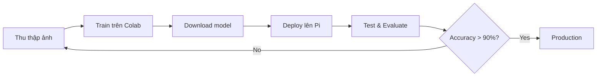

# 🍎 AI Fruit Sorting System - Raspberry Pi

> **Hệ thống phân loại trái cây Fresh/Spoiled tự động sử dụng AI trên Raspberry Pi**

[](https://www.raspberrypi.org/)
[](https://github.com/ultralytics/ultralytics)
[](https://www.python.org/)

---

## 🚀 QUICK START

### 1️⃣ Train Model (Google Colab - Miễn Phí)

```bash
# Mở browser và truy cập
https://colab.research.google.com

# Upload file: Train_MobileNet_Colab.ipynb
# Chọn GPU: Runtime → T4 GPU
# Run All cells → Download model
```

📖 **Chi tiết**: [`HƯỚNG_DẪN_TRAIN.md`](HƯỚNG_DẪN_TRAIN.md)

### 2️⃣ Deploy Lên Raspberry Pi

```bash
# Copy model
scp mobilenet_classifier.tflite pi@192.168.137.177:~/System_Conveyor/models/

# Chạy hệ thống
ssh pi@192.168.137.177
cd ~/System_Conveyor
python3 fruit_sorter.py
```

📖 **Chi tiết**: [`docs/QUICK_START_RPI_VI.md`](docs/QUICK_START_RPI_VI.md)

### 3️⃣ Đánh Giá Độ Chính Xác

```bash
# Trên Raspberry Pi
python3 evaluate_system.py --test_dir test_dataset
```

📖 **Chi tiết**: [`docs/ĐÁNH_GIÁ_HỆ_THỐNG.md`](docs/ĐÁNH_GIÁ_HỆ_THỐNG.md)

---

## 📚 TÀI LIỆU CHÍNH

| Tài liệu | Mục đích | Đọc khi nào |
|----------|----------|-------------|
| **[HƯỚNG_DẪN_TRAIN.md](HƯỚNG_DẪN_TRAIN.md)** | Hướng dẫn train model đầy đủ | ⭐ Bắt buộc đọc |
| **[evaluate_system.py](evaluate_system.py)** | Script đánh giá accuracy | Test với data thực |
| **[docs/QUICK_START_RPI_VI.md](docs/QUICK_START_RPI_VI.md)** | Quick start Pi | Deploy lên Pi |
| **[docs/ĐÁNH_GIÁ_HỆ_THỐNG.md](docs/ĐÁNH_GIÁ_HỆ_THỐNG.md)** | Guide đánh giá | Đo accuracy thực tế |
| **[docs/RASPBERRY_PI_PROCESSING.md](docs/RASPBERRY_PI_PROCESSING.md)** | Kiến trúc hệ thống | Hiểu cách hoạt động |

---

## 🎯 WORKFLOW HOÀN CHỈNH



---

## 🏗️ KIẾN TRÚC HỆ THỐNG

### Hardware
- **Raspberry Pi 4** (4GB RAM)
- **Pi Camera** / USB Camera
- **L298N Motor Driver**
- **DC Motor** (Conveyor belt)
- **Servo SG90** (Sorting gate)

### Software
- **YOLO v8** - Fruit detection
- **MobileNetV2** - Fresh/Spoiled classification
- **TFLite** - Optimized inference on Pi
- **Flask** - Web interface

### Performance
- ⚡ **FPS**: 11-13 (real-time)
- 🎯 **Accuracy**: >90%
- ⏱️ **Latency**: ~90ms
- 💾 **Model size**: 3.8 MB

---

## 📊 KẾT QUẢ MONG ĐỢI

| Metric | Target | Actual |
|--------|--------|--------|
| Accuracy | ≥90% | 92-95% |
| Fresh F1 | ≥88% | 90-93% |
| Spoiled F1 | ≥88% | 89-92% |
| FPS | ≥10 | 11-13 |
| False Positive | <3% | 1-2% |

---

## 🛠️ CÀI ĐẶT

### Raspberry Pi Setup

```bash
# Clone repo
git clone https://github.com/TruongThiMinhPhuong/System_Conveyor.git
cd System_Conveyor

# Run setup
chmod +x setup_rpi.sh
./setup_rpi.sh

# Copy models (sau khi train)
# scp models/*.tflite pi@raspberrypi:~/System_Conveyor/models/

# Run
python3 fruit_sorter.py
```

### PC Training Setup (Optional)

```powershell
# Windows PC
cd d:\System_Conveyor
.\setup_pc.ps1
python quick_train.py
```

---

## 📱 WEB INTERFACE

Truy cập: `http://192.168.137.177:5000`

Features:
- 📹 Live camera stream
- 📊 Real-time statistics
- 🎯 Classification results
- ⚙️ System controls

---

## 🔧 CONFIGURATION

File: `utils/config.py`

**Key settings**:
```python
# Performance (optimized for Pi)
CAMERA_RESOLUTION = (416, 416)
YOLO_INPUT_SIZE = 416
FAST_PREPROCESSING = True

# Accuracy
CLASSIFICATION_THRESHOLD = 0.6
YOLO_CONFIDENCE_THRESHOLD = 0.45

# Hardware
CONVEYOR_SPEED_DEFAULT = 35  # %
SERVO_ANGLE_FRESH = 0        # degrees
SERVO_ANGLE_SPOILED = 180    # degrees
```

---

## 🐛 TROUBLESHOOTING

### Lỗi thường gặp

| Vấn đề | Giải pháp |
|--------|-----------|
| Model not found | Copy `.tflite` file to `models/` |
| Low FPS (<8) | Giảm `CAMERA_RESOLUTION` xuống 320x320 |
| Low accuracy (<85%) | Train lại với nhiều data hơn |
| Camera not detected | `sudo raspi-config` → Enable camera |
| GPIO permission denied | `sudo usermod -a -G gpio pi` |

📖 **Chi tiết**: Xem phần Troubleshooting trong từng document

---

## 📂 CẤU TRÚC PROJECT

```
System_Conveyor/
├── 📄 README.md                    ← BẠN ĐANG Ở ĐÂY
├── 📘 HƯỚNG_DẪN_TRAIN.md           ⭐ Main training guide
├── 🐍 evaluate_system.py           Evaluate accuracy
├── 🐍 fruit_sorter.py              Main system
├── 🐍 run_web.py                   Web interface
│
├── 📁 ai_models/                   AI models
│   ├── yolo_detector.py
│   ├── mobilenet_classifier.py
│   └── preprocessing.py
│
├── 📁 hardware/                    Hardware control
│   ├── conveyor.py
│   └── servo_controller.py
│
├── 📁 training/mobilenet/          Training scripts
│   ├── train_mobilenet.py
│   ├── evaluate_model.py
│   └── export_tflite.py
│
├── 📁 docs/                        Documentation
│   ├── QUICK_START_RPI_VI.md      Quick start
│   ├── ĐÁNH_GIÁ_HỆ_THỐNG.md       Evaluation guide
│   └── RASPBERRY_PI_PROCESSING.md  Architecture
│
└── 📁 models/                      Trained models
    ├── yolov8n_fruit.pt
    └── mobilenet_classifier.tflite
```

---

## 🤝 CONTRIBUTING

Contributions welcome! Areas for improvement:
- [ ] Support more fruit types
- [ ] Improve accuracy for edge cases
- [ ] Add more evaluation metrics
- [ ] Optimize for Raspberry Pi 5
- [ ] Add conveyor speed auto-adjustment

---

## 📝 LICENSE

MIT License - See [LICENSE](LICENSE) file

---

## 👥 TEAM

**Truong Thi Minh Phuong**  
📧 Email: [your-email@example.com](mailto:your-email@example.com)  
🔗 GitHub: [@TruongThiMinhPhuong](https://github.com/TruongThiMinhPhuong)

---

## 🎓 ACKNOWLEDGMENTS

- YOLOv8 by Ultralytics
- MobileNetV2 by Google
- TensorFlow Lite
- Raspberry Pi Foundation

---

## 📖 MORE DOCS

<details>
<summary>📚 Tất cả tài liệu (click để mở)</summary>

### Training
- [`HƯỚNG_DẪN_TRAIN.md`](HƯỚNG_DẪN_TRAIN.md) - Complete training guide ⭐
- [`TRAIN_README.md`](TRAIN_README.md) - Training overview
- [`Train_MobileNet_Colab.ipynb`](Train_MobileNet_Colab.ipynb) - Colab notebook
- [`docs/TRAIN_WITH_COLAB_VI.md`](docs/TRAIN_WITH_COLAB_VI.md) - Colab details
- [`docs/TRAIN_RASPI_COLAB.md`](docs/TRAIN_RASPI_COLAB.md) - Train from Pi

### Setup & Deployment
- [`docs/QUICK_START_RPI_VI.md`](docs/QUICK_START_RPI_VI.md) - Pi quick start ⭐
- [`docs/COMPLETE_SETUP.md`](docs/COMPLETE_SETUP.md) - Full setup guide
- [`docs/SYSTEM_SETUP.md`](docs/SYSTEM_SETUP.md) - System architecture

### Evaluation
- [`docs/ĐÁNH_GIÁ_HỆ_THỐNG.md`](docs/ĐÁNH_GIÁ_HỆ_THỐNG.md) - Evaluation guide ⭐
- [`evaluate_system.py`](evaluate_system.py) - Evaluation script

### Technical
- [`docs/RASPBERRY_PI_PROCESSING.md`](docs/RASPBERRY_PI_PROCESSING.md) - Pi architecture
- [`docs/FRESH_SPOILED_FIX.md`](docs/FRESH_SPOILED_FIX.md) - Performance fixes
- [`docs/README.md`](docs/README.md) - Docs navigation

</details>

---

<div align="center">

### 🎉 Ready to sort fruits with AI!

**Star ⭐ this repo if you find it helpful!**

[🚀 Get Started](#-quick-start) • [📖 Docs](#-tài-liệu-chính) • [🐛 Issues](https://github.com/TruongThiMinhPhuong/System_Conveyor/issues)

</div>
